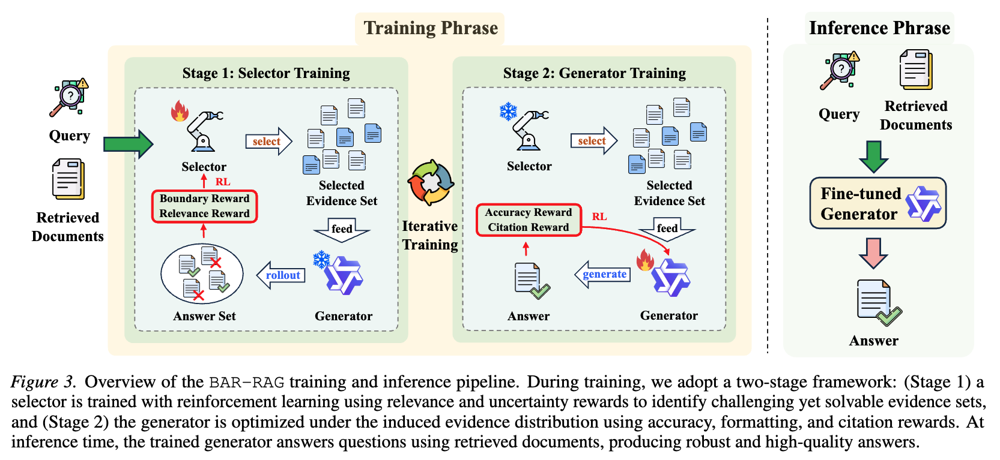
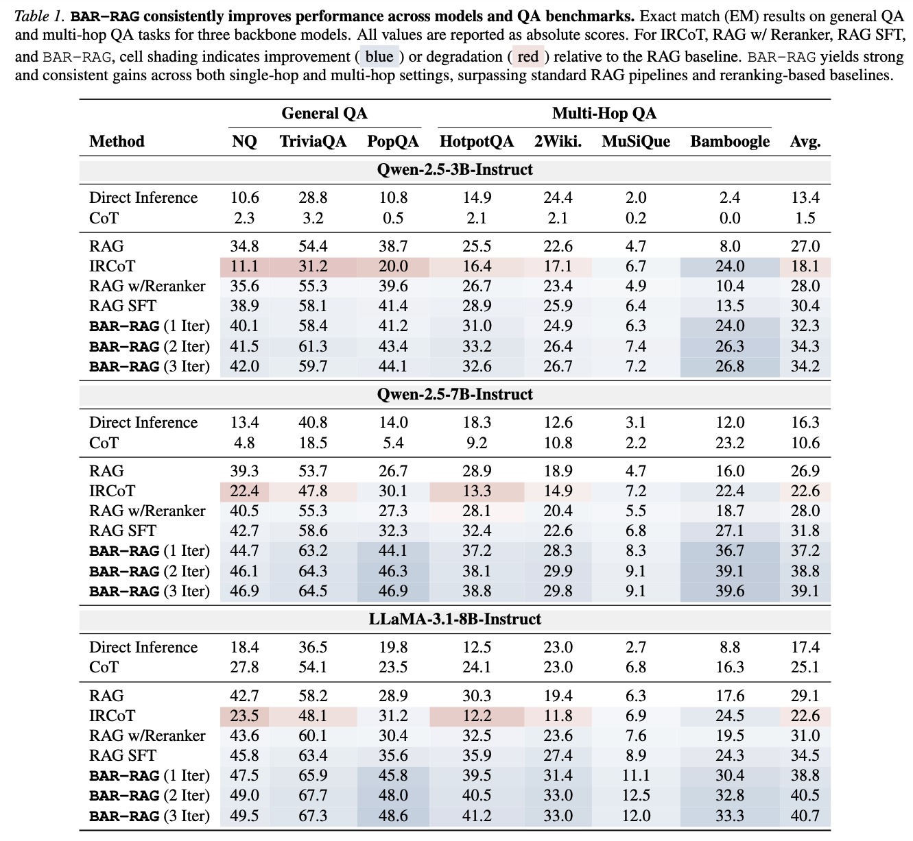

# BAR-RAG: Boundary-Aware Evidence Selection for Robust Retrieval-Augmented Generation

<div style='display:flex; gap: 0.25rem; flex-wrap: wrap; align-items: center;'>
  <a href='LICENCE'>
    
  </a>
  <a href='https://arxiv.org/abs/2602.03689'>
    
  </a>
</div>

**BAR-RAG** reframes the reranker in RAG systems as a **boundary-aware evidence selector** that targets the generator's **Goldilocks Zone** — evidence that is neither trivially easy nor fundamentally unanswerable, but challenging yet sufficient for inference. By training the selector with reinforcement learning using generator feedback, and then fine-tuning the generator under the induced evidence distribution, BAR-RAG achieves an **average gain of 10.3%** over strong RAG and reranking baselines on knowledge-intensive QA benchmarks.

<p align="center">
  
</p>

## How to Cite

If you use or extend this work, please cite our paper:

```bibtex
@misc{sun2026rethinkingrerankerboundaryawareevidence,
      title={Rethinking the Reranker: Boundary-Aware Evidence Selection for Robust Retrieval-Augmented Generation}, 
      author={Jiashuo Sun and Pengcheng Jiang and Saizhuo Wang and Jiajun Fan and Heng Wang and Siru Ouyang and Ming Zhong and Yizhu Jiao and Chengsong Huang and Xueqiang Xu and Pengrui Han and Peiran Li and Jiaxin Huang and Ge Liu and Heng Ji and Jiawei Han},
      year={2026},
      eprint={2602.03689},
      archivePrefix={arXiv},
      primaryClass={cs.CL},
      url={https://arxiv.org/abs/2602.03689}, 
}
```

## 🔥 Updates
* [2026-02-13]: 🚀 We release the code.
* [2026-02-03]: 🚀 We release the paper.

## Table of Contents

- [Overview](#overview)
- [Preliminaries](#-preliminaries)
- [Training Pipeline](#-training-pipeline)
  - [Step 1: Data Processing](#step-1-data-processing)
  - [Step 2: Training-time Filtering](#step-2-training-time-filtering)
  - [Step 3: Selector Training (Stage 1)](#step-3-selector-training-stage-1)
  - [Step 4: Selector → Generator Data Preparation](#step-4-selector--generator-data-preparation)
  - [Step 5: Generator Training (Stage 2)](#step-5-generator-training-stage-2)
  - [Iterative Training](#iterative-training)
- [Inference & Evaluation](#-inference--evaluation)
- [Main Results](#-main-results)
- [License](#-license)

---

## Overview

Standard rerankers in RAG systems optimize solely for relevance, often surfacing either trivially answer-revealing passages or evidence lacking critical information. BAR-RAG addresses this through a two-stage RL pipeline:

- **Stage 1 (Selector Training):** Train a selector via GRPO to identify evidence sets near the generator's **competence boundary** — hard-but-solvable — using boundary rewards and relevance rewards with generator rollouts.
- **Stage 2 (Generator Training):** Freeze the selector and fine-tune the generator under the selector's output distribution via GRPO, closing the train–test distribution gap.

At **inference time**, the selector is discarded entirely. The fine-tuned generator operates directly on standard retriever outputs (e.g., top-k from a dense retriever), incurring **zero additional inference cost**.

---

## 💡 Preliminaries

### Environment Setup

Install the required dependencies:
```bash
pip install -r requirements.txt
```

### Retrieval Corpus

You need to set up the retrieval corpus (2018 English Wikipedia dump with ~21M passages). We use [E5-base-v2](https://huggingface.co/intfloat/e5-base-v2) as the dense retriever. The corpus and embedding setup follows [Search-R1](https://github.com/PeterGriffinJin/Search-R1) — please refer to their Retriever Setup section.

### Backbone Models

BAR-RAG supports the following backbone models for both selector and generator:
- `Qwen2.5-3B-Instruct`
- `Qwen2.5-7B-Instruct`
- `LLaMA-3.1-8B-Instruct`

### Hardware Requirements

- Selector training: **8× A100 (40GB)** GPUs
- Generator training: **8× A100 (40GB)** GPUs
- Filtering: **8 GPUs** (4 for selector, 4 for generator via dual vLLM workers)

---

## 🚀 Training Pipeline

The full training pipeline follows these steps. **Steps 2–5 are repeated for each iteration** of the iterative training scheme.

### Step 1: Data Processing

Convert raw training data (JSONL with questions, answers, and retrieved contexts) into parquet format for the selector.

```bash
bash scripts/process_data.sh
```

This script runs three sub-steps:

1. **Convert to parquet:** Converts raw JSONL training data with top-25 retrieved documents into parquet format.
   ```bash
   python examples/convert_parquet.py \
     --input_path "data/train.jsonl" \
     --split_name "train" \
     --top_n 25 \
     --local_save_dir "data" \
     --output_name "train.parquet"
   ```

2. **Process selector data:** Formats the data with the selector prompt template (question + candidate documents).
   ```bash
   python examples/process_selector.py \
     --input_path data/train_rl.parquet \
     --output_path data/selector_train.parquet \
     --tokenizer_name_or_path "/Your-path/SELECTOR-model" \
     --max_input_tokens 4096 \
     --top_n 25
   ```

3. **Fix parquet:** Ensures proper data types and formatting.
   ```bash
   python examples/fix_parquet.py \
     --input_file data/selector_train.parquet \
     --output data/selector_train_fix.parquet
   ```

### Step 2: Training-time Filtering

Filter out trivially solvable and fundamentally unanswerable queries to ensure informative RL reward signals for the selector. This step uses **dual vLLM workers** — the selector on one set of GPUs and the generator on another — to estimate per-query solvability statistics.

```bash
bash scripts/filter.sh
```

### Step 3: Selector Training (Stage 1)

Train the selector with GRPO to target the generator's Goldilocks Zone. This requires **deploying the generator as a vLLM server** (and optionally an LLM judge) so the selector can perform generator rollouts during training.

**3a. Deploy the generator server:**
```bash
bash scripts/deploy_generator_vllm.sh
```

**3b. (Optional) Deploy the LLM judge server:**
```bash
bash scripts/deploy_llm_judge_vllm.sh
```

**3c. Run selector training:**
```bash
bash scripts/selector_training.sh
```


### Step 4: Selector → Generator Data Preparation

Use the trained selector to produce evidence sets for generator training data. The selector runs inference over the full training set, selecting documents for each query.

```bash
bash scripts/selector2generator.sh
```

```bash
python examples/candidate_generation.py \
    --input_path data/selector_train_fix.parquet \
    --local_save_dir data/generator_train \
    --split_name train \
    --model_name "/Your-path/SELECTOR-model" \
    --selector_top_n 25 \
    --max_selector_input_tokens 4096 \
    --max_new_tokens_selector 1024 \
    --tensor_parallel_size 4 \
    --batch_size_selector 128 \
    --gpu_memory_utilization 0.9
```

### Step 5: Generator Training (Stage 2)

Fine-tune the generator with GRPO under the selector-induced evidence distribution.

```bash
bash scripts/generator_training.sh
```

This uses the verl framework with GRPO, training the generator with accuracy rewards (F1 + EM) and citation rewards.

### Iterative Training

BAR-RAG alternates between selector and generator training for *T* iterations. In each iteration:

1. **Filter** the data using the current selector and generator (Step 2)
2. **Train the selector** against the frozen generator (Step 3)
3. **Generate data** with the updated selector (Step 4)
4. **Train the generator** under the new evidence distribution (Step 5)

In practice, **2–3 iterations** are sufficient — most gains are captured in the first two rounds.

---

## 🔍 Inference & Evaluation

At inference time, the selector is **discarded**. The fine-tuned generator answers questions directly using top-k retrieved documents from the standard retriever.

### Run Inference

```bash
bash scripts/inference.sh
```

This runs the generator over all evaluation benchmarks (NQ, TriviaQA, PopQA, HotpotQA, 2WikiMultiHopQA, MuSiQue, Bamboogle) using vLLM:

```bash
python qa_inference.py \
    --model_path "/Your-path/Generator-model" \
    --data_path "eval_data/nq.jsonl" \
    --output_path "results/nq_topk5_model.jsonl" \
    --top_k_ctx 5 \
    --max_new_tokens 1024 \
    --tensor_parallel_size 4
```

### Evaluate

```bash
bash scripts/eval.sh
```

```bash
python eval.py --pred_file results/nq_topk5_model.jsonl
```

Reports Exact Match (EM) and token-level F1 scores.

---


## 📊 Main Results
<p align="center">
  
</p>

---

## 📄 License

This project is licensed under the Apache 2.0 License. The project assumes no legal responsibility for any output generated by the models and will not be held liable for any damages resulting from the use of the provided resources and outputs.
